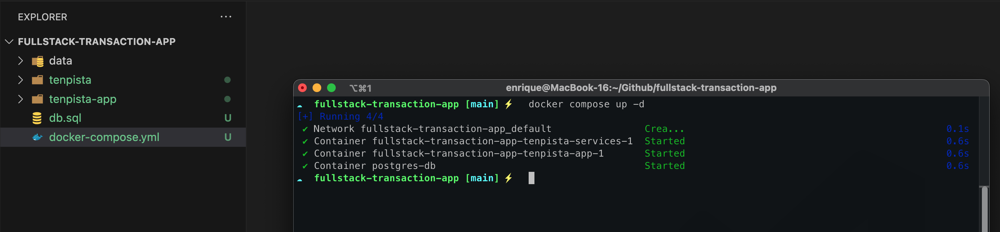
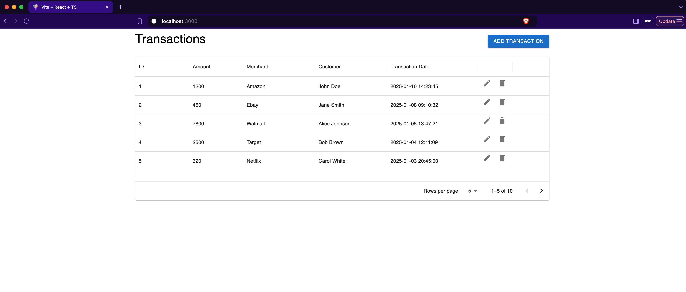
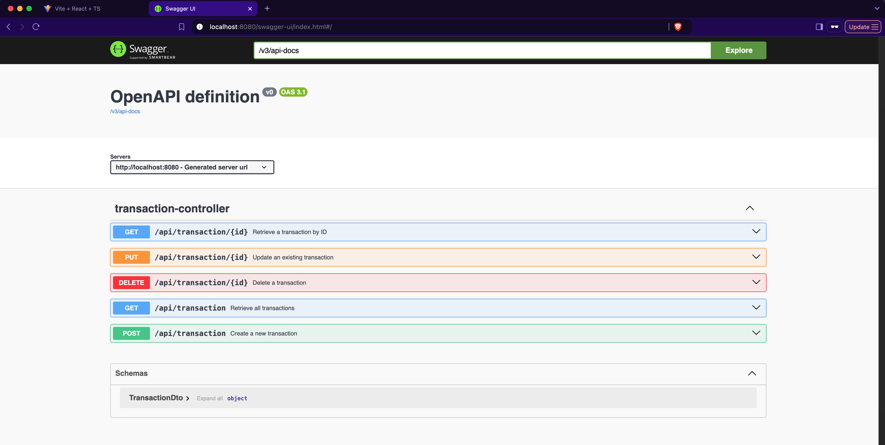

# FullStack Transaction Management App 🚀

A FullStack transaction management app using React and Spring Boot, with PostgreSQL, Docker support, and REST API for CRUD operations. Features include rate limiting, error handling, and a responsive UI (MUI). ✨

---

## Clone the Repository 📂

To get started, clone the repository to your local machine:

```bash
# Using HTTPS
git clone https://github.com/eromerv/fullstack-transaction-app.git

# Using SSH
git clone git@github.com:eromerv/fullstack-transaction-app.git

# Navigate into the project directory
cd fullstack-transaction-app
```

---

## Running the Application with Docker Compose 🐳

Follow these steps to build and run the application using Docker Compose:

### Step 1: Build the Docker Images 🛠️
Make sure you have Docker and Docker Compose installed on your system. Then, execute the following command to build the application:

> If you're using Docker Compose v1 (docker-compose), you need to upgrade to Docker Compose v2. 

```bash
# Explicitly build all services defined in docker-compose.yml file:
docker compose build

# or Use --no-cache if you want to avoid using cached layers:
docker compose build --no-cache
```

This will:
- Build the backend and frontend images.
- Prepare the PostgreSQL database image.

### Step 2: Start the Application 🚀
After building the images, start all services by running:

```bash
# Start all services in detached mode:
docker compose up -d
```

This will:
- Launch the backend, frontend, and database containers.
- Ensure that all services are connected and running together.



### Step 3: Verify the Containers are Running ✅
After running the `docker compose` command, verify that the containers are running:

```bash
docker ps
```
You should see containers for the backend, frontend, and database running.

### Step 4: Access the Application 🌐
- **Frontend:** Open your browser and go to `http://localhost:3000`
- **Backend API:** Swagger UI will be accessible at `http://localhost:8080/swagger-ui/index.html`

### Step 5: Stop the Containers (Optional) 🛑
To stop the containers, run:

```bash
# Stop the running containers without removing them:
docker compose stop
```

This will stop and remove all containers, networks, and volumes created by `docker compose`.

---

## Demo 🎥

### Frontend Interface:



### Swagger UI:



---

## Additional Notes 📝
- Ensure ports `3000`, `8080` (frontend/backend) and `5432` (PostgreSQL) are not blocked by other services.
- Customize environment variables in `docker-compose.yml` if needed.

Feel free to reach out if you have questions or need support setting up the project! 😊
